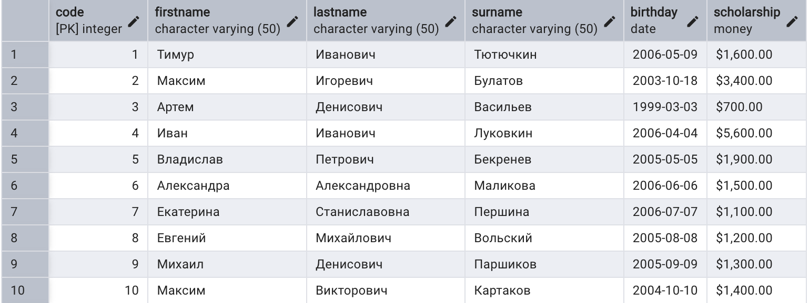

# Базовый синтаксис

Основным оператором  в реляционных базах данных является оператор выборки **SELECT**. С его помощью можно извлекать данные из таблиц и производить манипуляции над их представлением в результате выполнения.

Базовый синтаксис оператора следующий:

```sql
SELECT 
	<Список столбцов>
FROM
	<Список таблиц>
[WHERE 
	<условия отбора>]
[GROUP BY
	<условия группировки>]
[HAVING
	<условия выбора групп>]
[ORDER BY
	<условия сортировки>]
[LIMIT
	<максимальное число выводимых строк>]
```

## Описание основных выражений оператора

### SELECT (Выбрать)

В этом разделе указываются требуемые столбцы, данные из которых необходимо предоставить в результате запроса. Помимо указания самих столбцов здесь можно осуществлять преобразования выводимых данных. Такой подход достигается с указанием выражений и (или) функций.

### FROM (из)

После объявления этого выражения следует описать источники данных - таблицы, столбцы из которых указываются в SELECT-запросе. Здесь осуществляется отбор требующихся таблиц и их соединение, реализующееся с помощью оператора **JOIN** (соединение).

Выражение FROM является обязательным при выполнении SELECT-запроса, т.к. в явном виде указывает, из каких источников необходимо осуществлять выборку данных.

#### JOIN (Соединение источников данных)

Этот оператор напрямую связан с выражением **FROM** и используется для соединения таблиц между собой.

### WHERE (где)

Указанное выражение позволяет добавить условия отбора, при выполнении которых, строки из объявленных таблиц будут отображены в результате запроса.

### GROUP BY (сгруппировать по) 

Позволяет при обработке данных получить для каждой группы единственное значение по указанному перечню столбцов.

### HAVING (имеющие)

Данное выражение позволяет добавлять условия отбора для групп, указанных в выражении GROUP BY.

### ORDER BY (упорядочить по)

При указании этого выражения можно задавать условия сортировки выводимых пользователю данных. Здесь для каждого столбца таблицы указывается его наименование и направление упорядочивания: **ASC** (по возрастанию), **DESC** (по убыванию).

# Порядок выполнения запроса на выборку данных

Важную роль при работе с запросами на выборку данных из таблиц играет понимание порядка выполнения запроса в СУБД. Алгоритм обработки данных при выполнении операций выборки следующий:

1. **FROM**. Указание исходных данных, над которым будет происходить последующаяя обработка и вывод;
2. **JOIN**. Соединение между собой для получения Декартового произведения;
3. **ON**. Используется для указания правил соединения исходных таблиц между собой;
4. **WHERE**. Осуществление отбора строк по заданным условиям;
5. **GROUP BY**. Группировка полученных после отбора строк;
6. **HAVING**. Отбор групп;
7. **ORDER BY**. Упорядочивание результата;
8. **LIMIT**/**TOP**. Задание ограничения по количеству строк выводимого результата.

# Примеры выполнения 

## Выражение FROM

Является обязательным при составлении текст запроса и указывает на источник данных, с которыми происходит последовательная выборка.

## Параметры выражения SELECT

### Выборка столбцов

После указания выражения SELECT указываются имена столбцов, значения которых будут представлены в результате запроса. Порядок вывода столбцов напрямую зависит от указанного порядка их упоминания в тексте запроса. Имена столбцов указываются через запятую.

При обработке данных из разных таблиц может возникнуть ситуация, когда столбцы разных таблиц имеют одинаковые имена. В этом случае имя столбца необходимо записывать как составное, указывая перед ним имя соответствующей таблицы:

```sql
<Имя таблицы>.<Имя столбца>
```

#### Указание всех столбцов

Предположим, что необходимо вывести все данные о студентах, хранящиеся в базе. В таком случае необходимо осуществить следующий запрос:

```sql
SELECT *
FROM student;
```

Символ "\*" используется здесь вместо указания всех столбцов из таблицы. Иначе говоря, при указании этого символа после ключевого слова SELECT будут отображены все столбцы выбранных(ой) таблиц(ы).

Если необходимо указать столбцы в явном виде, можно использовать следующий запрос:

```sql
SELECT 
	code,
	firstname,
	lastname,
	surname,
	birthday,
	scholarship
FROM student;
```

И первый, и второй запрос при их выполнении выведут таблицу, содержащую все данные о студентах.



#### Выбор определенных столбцов таблицы

Предположим, что из таблицы **student** необходимо вывести лишь ФИО студентов. В таком случае требуется выполнить следующий запрос:

```sql
SELECT
	firstname,
	lastname,
	surname
FROM
	student;
```

Указание столбцов в выражении SELECT позволяет вывести только необходимые данные из таблицы.


### Выбор уникальных значений

Предположим, что необходимо вывести номера дисциплин, по которым проводились экзамены. Для этого необходимо из таблицы **session_results** выбрать столбец **subject**.

```sql
SELECT subject
FROM session_results;
```


Повторяющиеся данные в кортежах в результате запроса можно объяснить тем, что таблицы в терминологии SQL могут содержать одинаковые данные строки.

В целях исключения дублирующихся строк в запросе используется операция **DISTINCT**. Данное ключевое слово указывается только один раз для одного SELECT-запроса.

```sql
SELECT DISTINCT subject
FROM session_results;
```


Вместо выбора уникальных значений (**DISTINCT**) можно использовать оператор **ALL**. Он имеет противоположное действие - отображение всех строк таблицы и используется по умолчанию.

### Пользовательские названия для столбцов

Предположим, что необходимо вывести ФИО студентов. Названия столбцов должны быть следующими:

1. student_surname;
2. student_firstname;
3. student_lastname.

В таком случае необходимо осуществить следующий запрос:

```sql
SELECT 
	surname AS student_surname,
	firstname AS student_firstname,
	lastname AS student_lastname
FROM student;
```


Данный подход позволяет осуществлять переименование столбцов в запросе.

## Настройка выражения WHERE

После служебного слова WHERE указываются условия выбора строк, помещаемых в результат запроса. Существуют различные условия отбора данных.

### Сравнение значений

В языке SQL используются традиционные операции сравнения `=,<>,<,<=,>,>=`. В качестве условия в предложении WHERE можно использовать сложные логические выражения, использующие атрибуты таблиц, константы, скобки, операции AND, OR, отрицание NOT.

Предположим, что необходимо вывести ФИО преподавателя с номером 2.

```sql
SELECT 
	surname,
	firstname,
	lastname
FROM teacher
WHERE code = 2;
```


Получим информацию о предметах "Базы данных" и "Физика".

```sql
SELECT *
FROM subject
WHERE full_name = "Базы данных" OR full_name = "Физика";
```


### Проверка на принадлежность множеству

Аналогичный по своему назначению запрос можно задать следующим образом:

```sql
SELECT *
FROM subject
WHERE full_name IN ("Базы данных", "Физика");
```

Результат выполнения будет аналогичным.

### Проверка на принадлежность диапазону

Предположим, что необходимо вывести данные о дисциплинах с кодом от 2 до 5.

```sql
SELECT *
FROM subject
WHERE code BETWEEN 2 AND 5;
```


### Проверка строкового значения на соответствие шаблону

Предположим, что необходимо вывести номера групп, в названии которых есть число 45.

```sql
SELECT DISTINCT group_name
FROM students_in_group
WHERE group_name LIKE '%45%';
```


### Проверка на наличие null-значения

Для выполнения такого сравнения используется выражения **IS NULL** для выявления данных, соответствующих null-значению, и **IS NOT NULL** для тех данных, которые неравны null.

Необходимо выбрать студентов, которые окончили свое обучение в группе 245.


## Использование агрегатных функций

Для того, чтобы осуществлять вычисление данных по всем строкам запроса можно использовать агрегатные функции: **MAX**, **SUM**, **COUNT**, **FIRST**.

Найдем общее число студентов, данные о которых есть в БД.

```sql
SELECT COUNT(*)
FROM student;
```

Символ "\*" указывает на то, что подсчет студентов осуществляется среди всех строк результата.


## Группировка данных

С помощью выражения GROUP BY можно осуществлять группировку результата и проводить отбор по группам, используя выражение HAVING.

Найдем количество студентов по группам. Для этого спроектируем запрос поэтапно. 

Для начала найдем все записи о группах в таблице **students_in_group**.
   
```sql
SELECT group_name
FROM students_in_group;
```


Анализируя результат запроса, можем понять, что данные о студентах в группах можно сгруппировать по номерам группы.

```sql
SELECT group_name
FROM students_in_group
GROUP BY group_name;
```


Используем агрегатную функцию **COUNT** для подсчета числа студентов в каждой группе.

```sql
SELECT group_name, COUNT(student)
FROM students_in_group
GROUP BY group_name;
```


После группировки можно осуществить отбор по группам. Такой отбор осуществляется при помощи выражения **HAVING**.

Найдем группы, число данных о студентах которой больше 1.

```sql
SELECT group_name, count(group_name)
FROM students_in_group
GROUP BY group_name
HAVING count(group_name) > 1;
```


Важно понимать различие между операторами сравнения. HAVING используется для отбора данных по уже сформированным группам и их свойствам, когда выражение WHERE используется для отбора каждой отдельной строки запроса.

Так в примере существует группа 245, в которой есть студент, закончивший свое обучение. Для того, чтобы исключить такие записи из отбора, необходимо задать подходящие условия в выражении WHERE существующего запроса.

```sql
SELECT group_name, count(group_name)
FROM students_in_group
WHERE date_end IS NULL
GROUP BY group_name;
```


Как можно заметить, число студентов группы 245 изменилось.

## Упорядочивание результата

С помощью выражения ORDER BY можно осуществить сортировку. При указании столбца для сортировки по умолчанию устанавливается правило сортировки по возрастанию (**ASC**), однако можно осуществить упорядочивание в обратном порядке, установив параметр **DESC**.

Предположим, нужно вывести номера групп и число студентов, входящих в них, в порядке возрастания количества.

```sql
SELECT group_name, count(group_name) AS student_count
FROM students_in_group
WHERE date_end IS NULL
GROUP BY group_name
ORDER BY student_count;
```


## Объединение строк запроса

С помощью оператора UNION можно объединять результаты запросов в одну общую таблицу.

Предположим, нужно вывести число студентов групп 245 и 246. Такой запрос можно осуществить с помощью: 

- Отбора по принадлоежности ко множеству (WHERE):

```sql
SELECT group_name, count(group_name) AS student_count
FROM students_in_group
WHERE date_end IS NULL AND group_name IN ('245', '246')
GROUP BY group_name;
```

- Объединения двух запросов с отбором:

```sql
SELECT group_name, count(group_name) AS student_count
FROM students_in_group
WHERE date_end IS NULL AND group_name = '245'
GROUP BY group_name

UNION

SELECT group_name, count(group_name) AS student_count
FROM students_in_group
WHERE date_end IS NULL AND group_name = '246'
GROUP BY group_name;
```

Оба запроса выведут одинаковый результат.


## Пересечение множеств

С помощью оператора INTERSECT можно осуществлять запрос на пересечение двух множеств.

Найдем номера студентов, данные о которых есть и в группе 245, и в группе 246.

```sql
SELECT student
FROM students_in_group
WHERE group_name = '245'

INTERSECT

SELECT student
FROM students_in_group
WHERE group_name = '246'
```

Запрос выведет те данные, которые находятся как в результате выполнения первого запроса, так и в результате второго.


## Вычитание множеств

С помощью выражения EXCEPT можно осуществлять вычитание множеств.

Найдем студентов, данные о которых не представлены в таблице о результатах сессии.
```sql
SELECT code
FROM student

EXCEPT

SELECT student
FROM session_results;
```


